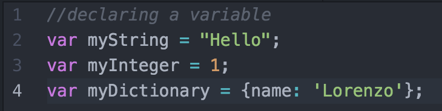
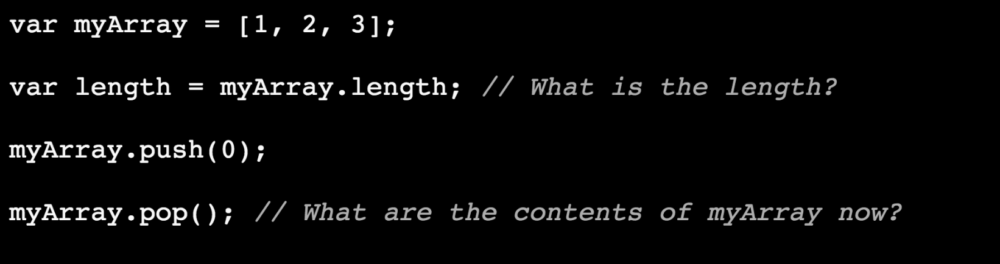
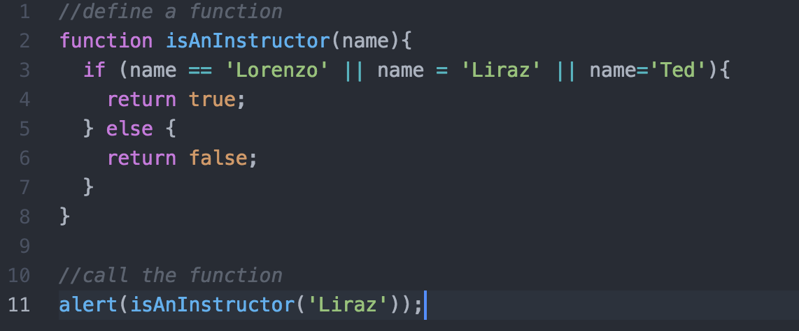
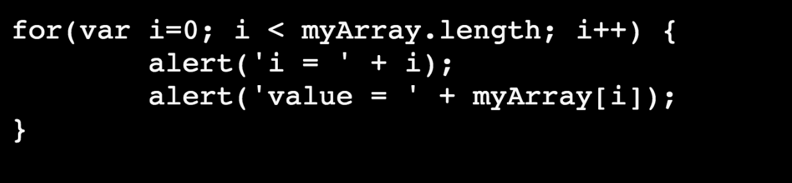

# Week 5 - Intro to JavaScript
In today's lab, you will be refreshing your JavaScript skills and creating a social media applicaiton called "MEETBook"


__PLEASE REMEMBER TO SAVE YOUR WORK AND SUBMIT A PULL REQUEST WHEN YOU ARE FINISHED__

## Part 1 - JavaScript Basics
You will be using a cool online editing program called JSFiddle to practice executing your code. Paste your answers in the answers.js file included in this lab.

Perform each of these operations on a seperate line of code.
### 1. Variables



* Declare a float variable called "temperature" and set it equal to 98.6

* Increase temperature's values by 5

* Multiply temperature's new value by 3

* Subtract temperatures's new value by 20
* Print out the new value of temperature


### 2. Data Structures


* Create an array called Days_of_the_Week containing the strings "Sunday", "Monday", "Tuesday", "Wednesday", "Thursday", "Friday" and "Saturday" as entries.

* Translate all of these days of the week into Spanish by referencing their indicies. 
Ex:  Days_of_the_Week[0] = "domingo";

```
0 - domingo
1 - lunes
2 - martes
3 - miercoles
4 - Jueves
5 - viernes
6 - sabado
```
* Create a dictionary containing key/value pairs of ice cream flavors and their costs:


```
Vanilla : $1.99
Chocolate : $2.49
Strawberry : $2.25
```
* Update the cost of Chocolate to $.99, create an entry for Pistacio at the price of your choice, and delete Strawberry from the dictionary. Print out your new dictionary.


### 3.Functions & Conditional Statements


* Write a function called ```DoIHaveToGoToSchoolToday(index)``` that takes in an integer value which represents the day of the week (0 = Sunday, 6 = Saturday)  It should either print out "Yes, today is {day of the week} . You have to go to school." or "No, today is {day of the week} based upon the days you and your partner go to school.  If there is a day where only one of you is off, let's assume you both get that day off :-) 

## 4.Loops


You are monitoring the price of gasoline in your neighborhood over the course of a year. Each month you store the price of a liter of gasoline in the list below:

```price_of_Gasoline = [5.88, 5.93,6.05,4.99,5.66,6.08,5.33,6.01,4.87,6.99,7.03,5.52]```

Write a for loop that will calculate how much we spent per month in gasoline if each month we bought 40 liters of gas.


## Part 2 - DOM Manipulation
__Hey, I've got an idea, let's do a hostile takeover of the MEET website!!__

* In your browser open ```http://meet.mit.edu```

* Right-click anywhere in your screen and select "Inspect".  This will bring up a set of development tools that we can use directly on any website.

* Hover through the page and see if you can find the div container that holds the form for signing up for the newsletter.

* On the console tab in the developer tools type the following:


```document.getElementsByClassName('col-3 right')[0].style.display="None"; ```

What happened?  Can you explian what this code is doing to the DOM? Write your answer in the answers.js file. 


## Part 3 - MEETBook

In this portion of the lab you will design a social network for MEET called “MEETBook”. All the necessary files are in a folder called MEETBook in this repository

In the head, under where you've imported your css, add:

``` 
<script type="text/javascript" src="http://code.jquery.com/jquery-
latest.min.js"></script>
<script type="text/javascript" src="http://code.jquery.com/ui/1.10.3/
jquery-ui.min.js"></script>
<script type="text/javascript">
$(document).ready(function () {
   alert('I love falafel!’);
});
</script>

```


* Save and reload the page. If you did this right, you should get a popup that tells you that you love falafel.

* Now remove the alert statement and replace it with:

```
$('body').click(function() {
     var firstElement = $(this).first();
     firstElement.css('background-color', 'red');
});
```
* Click anywhere in the body of your news feed page and see what happens.


Now that you've got a good grasp of the basics, lets add some functionality to the MEETBook experience!

 * Add jQuery to the page. The latest version of jQuery can be found here:

```
<script type="text/javascript" src="http://code.jquery.com/jquery-
latest.min.js"></script>'''
* Make sure that jQuery loaded and actually works. To do this, create a new script tag like so:
'''<script type="text/javascript">
  $(document).ready(function () {
        alert('i love cats');
  });
</script>
```
Now refresh the page in the browser and see what happens.

## Adding MEETBook Functionality
Take a look at the MEETbook news feed. It's pretty static, right? For this lab, you're going to make it more interactive. Here are some ideas:

* Make statuses change color when you hover over them.
* Add a little 'x' to the top of each status so that when you click on it, the status gets deleted/ hidden.
* Take a look at what animations and widgets are available in jQueryUI and steal one of them for your page
* [Demos](http://jqueryui.com/demos/) (I think draggable is really cool!!)
* [Documentation](http://api.jqueryui.com/)

* If you use jQueryUI, don't forget to include it with a ```<script>``` tag in the ```<head>```
* Add a textbox to the top of the page where you can input a new status. Make a button so that when you click it, the status gets added to the page
* Or you can do something else that isn't on this list. Just think of something fun and create it!!
* Start writing your own code in the function that's passed to ```$document.ready()``` (remove the 'i love cats' alert and put your own code).


## Part 4 - Extra Practice 
Check out some more really cool [JavaScript Exercises](http://www.w3resource.com/javascript-exercises/) that you can implement on your website.

